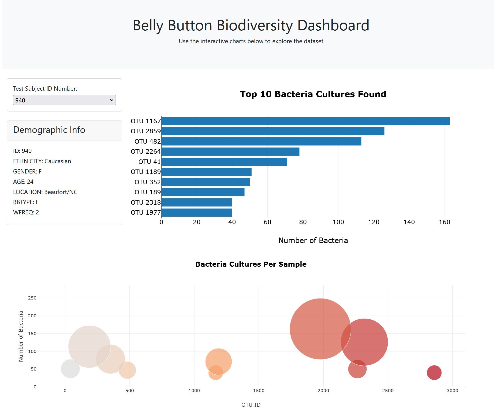

# belly-button-challenge

In this assignment, an interactive dashboard to expolre the .

The application was deployed to GitHub pages, as follows:

[HTML VIEW](https://purcellcjp.github.io/)

The demographic information panel updates whenever a new Subject ID is selected.

### REFERENCES:
* bubble chart: https://plotly.com/javascript/bubble-charts/
* Hulcr, J. et al. (2012) A Jungle in There: Bacteria in Belly Buttons are Highly Diverse, but Predictable. Retrieved from: http://robdunnlab.com/projects/belly-button-biodiversity/results-and-data/
